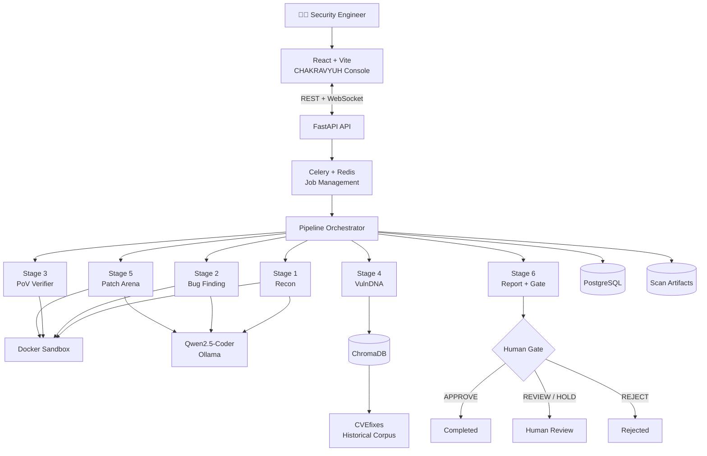

# 🛡️ CHAKRAVYUH

<p align="center">
  
  
  
  
</p>

<p align="center">
  <strong>AI-Assisted Vulnerability Discovery & Adversarial Patch Validation for C/C++</strong>
</p>

<p align="center">
  <em>Discover. Prove. Correlate. Patch. Attack the Patch. Verify. Human Gate.</em>
</p>

---

## ⚡ Overview

**CHAKRAVYUH** is an evidence-driven security engineering platform for
**C/C++ vulnerability discovery, runtime verification, historical CVE intelligence,
and automated patch validation.**

Unlike LLM-only security tools, CHAKRAVYUH combines:

- 🔎 Static analysis & program reconnaissance
- 🧠 Qwen2.5-Coder assisted security reasoning
- 🧪 AFL++ fuzzing & boundary-aware input generation
- 🧯 ASan / UBSan runtime verification
- 🧾 Proof-of-Vulnerability (PoV) verification
- 🧬 VulnDNA historical CVE intelligence
- ⚔️ Multi-agent adversarial patch validation
- 📊 Deterministic SAFE / REVIEW / HOLD decisions
- 👤 Human approval before final action

> **LLMs propose. Runtime evidence proves. Historical evidence guides.  
> Adversarial testing challenges. Humans decide.**

---

## 🔬 Security Pipeline

```text
┌─────────────┐
│ C/C++ Target│
└──────┬──────┘
       │
       ▼
┌──────────────────┐
│  1. RECON ENGINE │
│ tree-sitter      │
│ Semgrep          │
│ input → sink map │
│ Qwen risk rank   │
└────────┬─────────┘
         │
         ▼
┌──────────────────────┐
│ 2. BUG FINDING       │
│ Static + AFL++ + LLM │
│ Harness + Seeds      │
│ ASan / UBSan         │
└──────────┬───────────┘
           │
           ▼
┌──────────────────────┐
│ 3. PoV VERIFIER      │
│ Replay + Sanitizers  │
│ Stack Trace + CWE    │
│ Confidence + Dedup   │
└──────────┬───────────┘
           │
           ▼
┌──────────────────────┐
│ 4. VulnDNA           │
│ Verified PoV         │
│        ↓             │
│ CVEfixes corpus      │
│        ↓             │
│ Historical precedent │
└──────────┬───────────┘
           │
           ▼
┌──────────────────────┐
│ 5. PATCH ARENA       │
│ Agent 1              │
│ Agent 2              │
│ Agent 3              │
│ Compile + Test       │
│ Attack Variants      │
└──────────┬───────────┘
           │
           ▼
┌──────────────────────┐
│ 6. SECURITY REPORT   │
│ SAFE / REVIEW / HOLD │
└──────────┬───────────┘
           │
           ▼
┌──────────────────────┐
│ 👤 HUMAN GATE        │
│ APPROVE / REJECT     │
│ HOLD                 │
└──────────────────────┘
```

---

## 🧠 Architecture



---

## 🧬 Core Components

| Component | Purpose |
|---|---|
| **Recon Engine** | Maps functions, inputs, sinks and security-critical paths |
| **Bug Finding** | Combines Semgrep, AFL++, LLM reasoning and sanitizers |
| **PoV Verifier** | Replays crashes and produces reproducible runtime evidence |
| **VulnDNA** | Correlates findings with historical CVE/patch data |
| **Patch Arena** | Generates and compares multiple remediation strategies |
| **Security Gate** | Scores patches and produces SAFE / REVIEW / HOLD |
| **Human Gate** | Prevents automatic production deployment |

---

## ⚔️ Patch Arena

Three independent strategies compete:

| Agent | Strategy |
|---|---|
| 🧠 Root Cause Fixer | Addresses the underlying data flow |
| 🧬 Evidence-Guided Fixer | Uses historical CVE remediation patterns |
| 🎯 Direct Fixer | Applies a minimal targeted correction |

### Patch Score

| Metric | Weight |
|---|---:|
| Security | **50%** |
| Regression | **25%** |
| Performance | **15%** |
| Re-discovery | **10%** |

Every candidate is compiled, regression-tested, attacked with variants,
and checked for vulnerability re-discovery.

---

## 🧱 Technology Stack

| Layer | Technology |
|---|---|
| Frontend | React 19, Vite 8 |
| UI | Tailwind CSS, Framer Motion |
| Backend | FastAPI |
| Async Jobs | Celery + Redis |
| Database | PostgreSQL |
| Vector Store | ChromaDB |
| Embeddings | Nomic Embed Text v1.5 |
| LLM | Qwen2.5-Coder + Ollama |
| Parsing | tree-sitter |
| Static Analysis | Semgrep |
| Fuzzing | AFL++ |
| Verification | ASan / UBSan |
| Isolation | Docker |
| Language | C/C++ |

---

## 📁 Project Structure

```text
CHAKRAVYUH/
├── frontend/
│   └── src/
│       ├── components/
│       ├── context/
│       ├── pages/
│       └── ...
│
├── backend/
│   ├── api/
│   ├── orchestrator/
│   ├── workers/
│   │   ├── recon/
│   │   ├── bug_finding/
│   │   ├── pov_verifier/
│   │   ├── vulndna/
│   │   ├── patch_engine/
│   │   └── report/
│   ├── core/
│   ├── db/
│   ├── vulndna/
│   └── tests/
│
├── IMPLEMENTATION_PLAN.md
└── README.md
```

---

## 🚀 Quick Start

### 1. Clone

```bash
git clone https://github.com/Aditya0825-crypto/CHAKRAVYUH.git
cd CHAKRAVYUH
```

### 2. Backend

```bash
cd backend

python3.11 -m venv .venv
source .venv/bin/activate

pip install -r requirements.txt
```

Configure:

```bash
cp .env.example .env
```

### 3. Start Services

```bash
sudo service postgresql start
sudo service redis-server start
```

### 4. Ollama

```bash
ollama pull qwen2.5-coder
```

Configure the Ollama host in `.env`.

### 5. Sandbox

```bash
docker build -t chakravyuh-sandbox:latest .
```

### 6. Start Backend

```bash
uvicorn api.main:app --host 0.0.0.0 --port 8000 --reload
```

### 7. Start Celery

```bash
celery -A workers.celery_app worker --loglevel=info
```

### 8. Start Frontend

```bash
cd frontend
npm install
npm run dev
```

---

## 🔌 API

```text
GET  /api/health

POST /api/scans/upload
GET  /api/scans
GET  /api/scans/{id}

GET  /api/scans/{id}/recon
GET  /api/scans/{id}/findings
GET  /api/scans/{id}/povs
GET  /api/scans/{id}/vulndna
GET  /api/scans/{id}/patches
GET  /api/scans/{id}/report

GET  /api/vulndna/search

POST /api/scans/{id}/gate

WS   /api/scans/{id}/stream
```

---

## 🧪 Validation

CHAKRAVYUH includes test targets for validating the complete pipeline:

```text
backend/tests/fixtures/
├── vulnerable_server/
├── clean_hello/
└── known_cve_sample/
```

The golden path is:

```text
Target
  ↓
Recon
  ↓
Bug Finding
  ↓
ASan Crash
  ↓
PoV Verification
  ↓
VulnDNA
  ↓
Patch Arena
  ↓
Adversarial Testing
  ↓
Security Report
  ↓
Human Gate
```

---

## 🔐 Security & Responsible Use

CHAKRAVYUH is designed for:

- Authorized security testing
- Defensive vulnerability research
- Secure code review
- Controlled fuzzing
- Patch validation
- Security research and education

Target execution is isolated through Docker-based sandboxes.

**Only analyze software you own or have explicit authorization to test.**

CHAKRAVYUH does **not** automatically deploy generated patches.

---

## 🛣️ Roadmap

- [x] C/C++ security pipeline
- [x] Recon Engine
- [x] Static analysis
- [x] AFL++ integration
- [x] ASan / UBSan verification
- [x] PoV verification
- [x] VulnDNA
- [x] Multi-agent Patch Arena
- [x] Adversarial patch testing
- [x] Human Gate
- [ ] Full CVEfixes corpus
- [ ] CodeQL integration
- [ ] AFLGo / SymCC escalation
- [ ] Multi-language support
- [ ] PDF security reports
- [ ] CI/CD integration

---

## 📚 References

- [CVEfixes](https://github.com/secureIT-project/CVEfixes)
- [Ollama](https://ollama.com/)
- [Qwen](https://qwenlm.github.io/)
- [FastAPI](https://fastapi.tiangolo.com/)
- [Semgrep](https://semgrep.dev/)
- [AFL++](https://aflplus.plus/)
- [Docker](https://www.docker.com/)
- [tree-sitter](https://tree-sitter.github.io/tree-sitter/)

---

<p align="center">
  <strong>🛡️ CHAKRAVYUH</strong><br>
  Evidence-driven security engineering for modern C/C++ software.
</p>

<p align="center">
  <em>Discover → Prove → Correlate → Patch → Attack → Verify → Human Gate</em>
</p>
